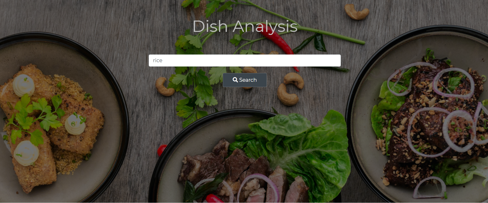

# Dish Analysis 
**lets take look about the my teammates projects**

[This is link for our web project](https://vihanhackathon.netlify.app/ "Please have a look")

## Some discription about the project
 
 On this page we search for food items and accordingly we can get data like nutrients about certain food 🍲 
 
 
 
 On this page we can watch all stuff related to rich come on .
 
 
 
 *** 
 **The problem it solved** : We are making a web app which can give the nutrients of a dish by its name.
A lot of restaurants have delicious dishes which attracts the customers but some of these dishes is not healthy at all containing a lot of fat or sugar.
This project will help the customers to get the nutrients list of the specific dish by just entering its name.
***

***
**Future Aspects** : As the world realizes that health is the only wealth. People are now becoming more concerned about their diet but simultaneously they prefer delicious dishes. This project will let them know that whether their "delicious" dish is healthy or not and will help them to choose healthy and delicious diet.
***
